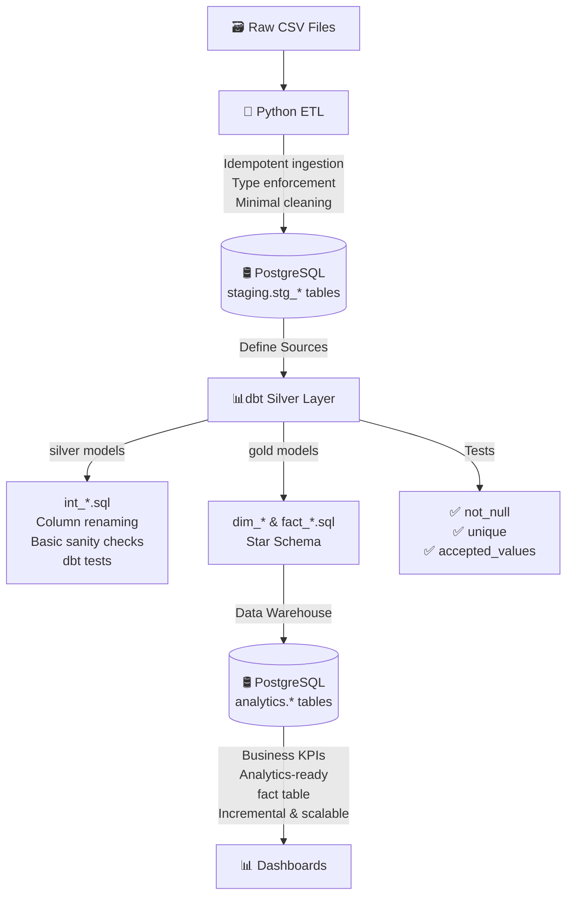

# 🏦 Bank Branch Performance ETL Pipeline

## Project Overview

This project demonstrates a **full Bronze–Silver–Gold ETL pipeline** for bank branch performance data using **Python, PostgreSQL, and dbt**.

The pipeline is designed for **idempotent, incremental loading**, ensuring **data quality** and **analytical readiness** for BI dashboards.

---

## Architecture



**Layer Responsibilities**

| Layer  | Tool   | Responsibilities                                                              |
| ------ | ------ | ----------------------------------------------------------------------------- |
| Bronze | Python | Extract CSVs, enforce schema, minimal cleaning, idempotent load to PostgreSQL |
| Silver | dbt    | Rename columns, enforce basic sanity, run tests, prepare for Gold             |
| Gold   | dbt    | Aggregate metrics, calculate KPIs, BI-ready fact table, incremental updates   |

---

## Tech Stack

* **Python 3.12** – ETL scripts, cleaning, and loading
* **Pandas** – Data manipulation and transformation
* **PostgreSQL** – Data warehouse storage
* **dbt (v1.x)** – Silver & Gold modeling, testing, incremental loading
* **psycopg2 / SQLAlchemy** – Database connection and batch loading

---

## Features

* **Idempotent Bronze ingestion**
* **Incremental dbt models** to avoid reprocessing old data
* **Data Quality KPIs** for tracking nulls and transformation impact
* **Primary key enforcement** for branch and date
* **Analytics-ready Gold fact table** with derived metrics
* **dbt tests** for uniqueness, non-null constraints, and simple business logic

---

## Folder Structure
```
.
├── .gitignore
├── diagram.md
├── docker-compose.yml
├── README.md
├── requirement.txt
├── data/
│   ├── bank_branch_performance.csv
│   ├── dim_bank_branch.csv
│   ├── dim_date.csv
│   └── fact_bank_branch_performance.csv
├── dbt_branch_performance/
│   ├── .gitignore
│   ├── dbt_project.yml
│   ├── analyses/
│   ├── dbt_packages/
│   ├── logs/
│   ├── macros/
│   ├── models/
│   ├── seeds/
│   ├── snapshots/
│   └── target/
├── etl/
│   ├── __init__.py
│   ├── bronze_cleaner.py
│   ├── config.py
│   ├── extract.py
│   ├── load.py
│   ├── pipeline.py
│   └── transform.py
├── logs/
└── sql/
    └── create_tables.sql
```
---

## Setup Instructions

1. **Clone the repository**

```bash
git clone <repo_url>
cd project_1
```

2. **Create virtual environment**

```bash
python -m venv .venv
source .venv/bin/activate  # Linux / Mac
.venv\Scripts\activate     # Windows
pip install -r requirements.txt
```

3. **Configure PostgreSQL**

* Update `config.py` or `.env` with DB credentials:

```python
DB_CONFIG = {
    "host": "localhost",
    "port": 5432,
    "database": "de_db",
    "user": "username",
    "password": "password"
}
```

4. **Run ETL pipeline (Bronze load)**

```bash
python etl/pipeline.py
```

5. **Run dbt models (Silver → Gold)**

```bash
cd dbt
dbt deps
dbt run
dbt test
```

---

## Data Pipeline Flow

1. **Extract**: CSV files loaded into **Bronze schema** via Python.
2. **Transform (Bronze)**: Apply type enforcement, clean text, dates, numerics. Track KPI.
3. **Load (Bronze)**: Insert into `bronze.stg_bank_branch_performance` with **idempotency**.
4. **dbt Silver**: Rename columns, enforce basic sanity, run tests.
5. **dbt Gold**: Create **fact table** with KPIs, incremental updates, BI-ready.

---

## Example KPI

```
Column               Nulls Introduced   Cleaning Method
branch_id             0                 strip_and_basic_null_normalization
branch_name           0                 strip_and_basic_null_normalization
performance_date      2                 datetime_coercion
total_deposits        0                 numeric_type_coercion
...
```

---

## Testing & Validation

* **dbt tests**:

  * `not_null` on branch_id, performance_date
  * `unique_combination_of_columns` for branch_id + performance_date
  * Expression test for calculated KPIs

* **Python KPIs**: Nulls introduced, type coercion effects

---

## Next Steps / Enhancements

* Add **dimension tables** (`dim_branch`) for richer analytics
* Connect **Power BI / Tableau** to Gold table
* Schedule ETL with **Airflow**
* Add **unit tests** for Python cleaning logic

---

## Author

**Abdulhafiz Yusuf** – Junior Data Engineer
[GitHub](https://github.com/Abdulhafiz-Yusuf)


