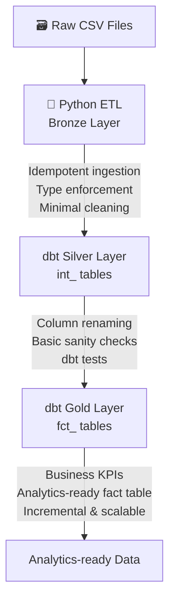

```mermaid
flowchart TD
    CSV[🗃️ Raw CSV Files] --> B[🐍 Python ETL<br/>Bronze Layer] 
    B -- "Idempotent ingestion<br/>Type enforcement<br/>Minimal cleaning" --> C[dbt Silver Layer<br/>int_ tables]
    C -- "Column renaming<br/>Basic sanity checks<br/>dbt tests" --> D[dbt Gold Layer<br/>fct_ tables]
    D -- "Business KPIs<br/>Analytics-ready fact table<br/>Incremental & scalable" --> E[Analytics-ready Data]
```