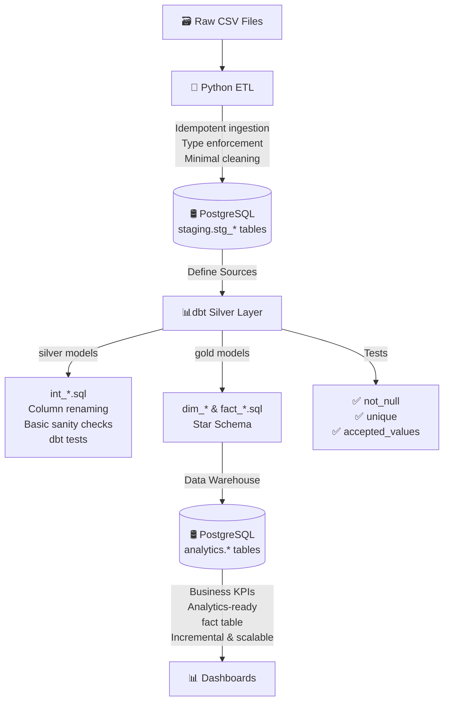

```mermaid
flowchart TD
    CSV[🗃️ Raw CSV Files] --> Python[🐍 Python ETL]
    Python -->|Idempotent ingestion<br/>Type enforcement<br/>Minimal cleaning| Postgres[(🛢️ PostgreSQL<br/>staging.stg_* tables)]
    
    Postgres -->|Define Sources| dbt[📊dbt Silver Layer]
    dbt -->|silver models| StagingM["int_*.sql<br/>"Column renaming<br/>Basic sanity checks<br/>dbt tests""]
    dbt -->|gold models| AnalyticsM["dim_* & fact_*.sql<br/>Star Schema"]
    
    AnalyticsM -->|Data Warehouse| DW[(🛢️ PostgreSQL<br/>analytics.* tables)]
    dbt -->|Tests| Tests["✅ not_null<br/>✅ unique<br/>✅ accepted_values"]
    
    DW -->|Business KPIs <br/>Analytics-ready <br/>fact table<br/>Incremental & scalable| Reports[📊 Dashboards]
```