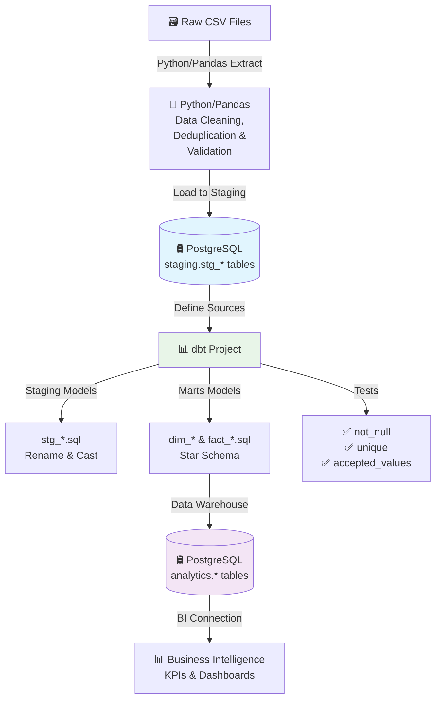

```mermaid
flowchart TD
    CSV[🗃️ Raw CSV Files] -->|Python/Pandas Extract| Clean[🐍 Python/Pandas
    Data Cleaning, <br/> Deduplication &<br/> Validation]
    Clean -->|Load to Staging| Postgres[(🛢️ PostgreSQL<br/>staging.stg_* tables)]
    
    Postgres -->|Define Sources| dbt[📊 dbt Project]
    dbt -->|Staging Models| StagingM["stg_*.sql<br/>Rename & Cast"]
    dbt -->|Marts Models| AnalyticsM["dim_* & fact_*.sql<br/>Star Schema"]
    
    AnalyticsM -->|Data Warehouse| DW[(🛢️ PostgreSQL<br/>analytics.* tables)]
    dbt -->|Tests| Tests["✅ not_null<br/>✅ unique<br/>✅ accepted_values"]
    
    DW -->|BI Connection| Reports[📊 Business Intelligence<br/>KPIs & Dashboards]
    
    style Postgres fill:#e1f5fe
    style DW fill:#f3e5f5
    style dbt fill:#e8f5e8
```